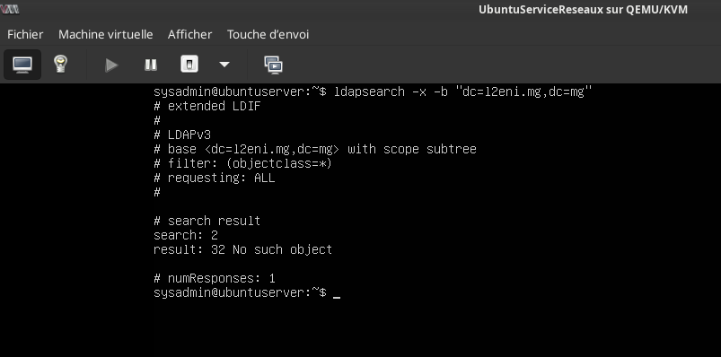
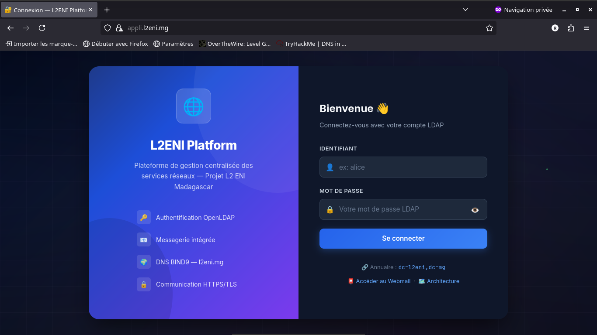
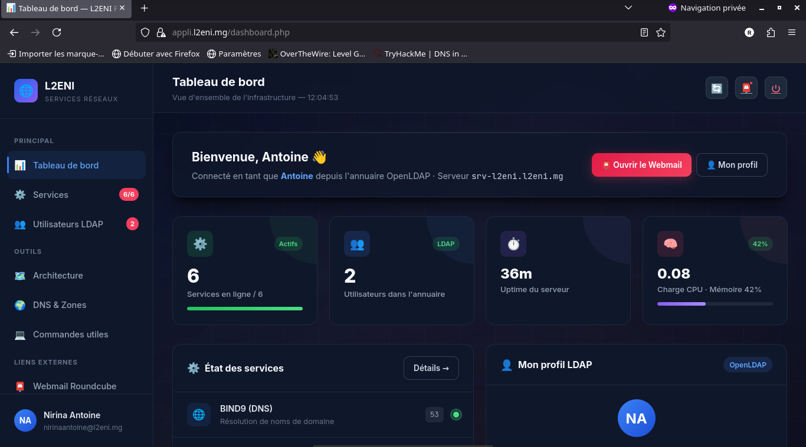
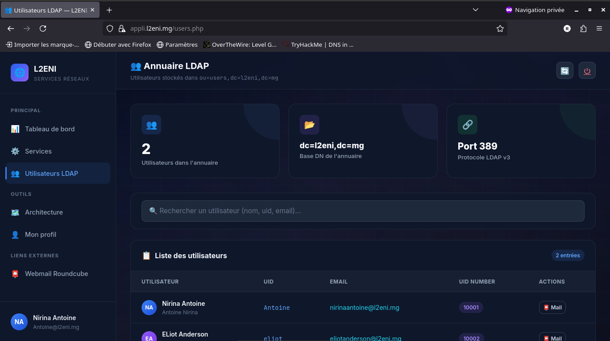
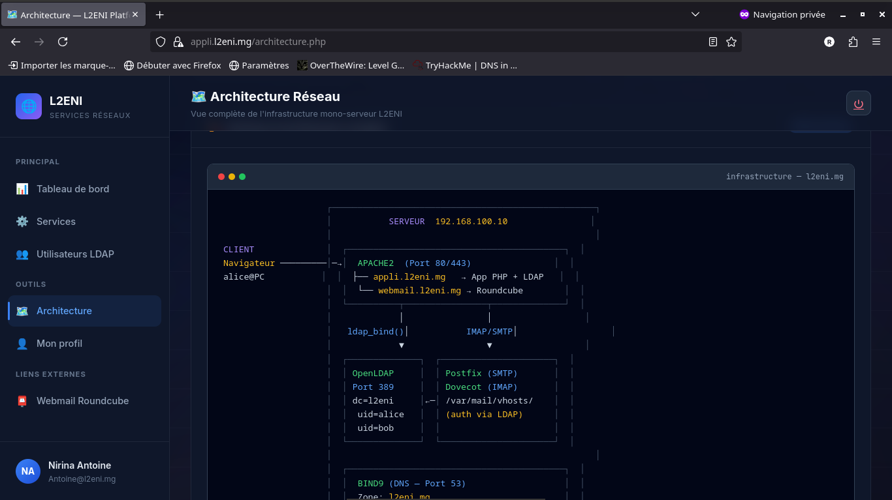
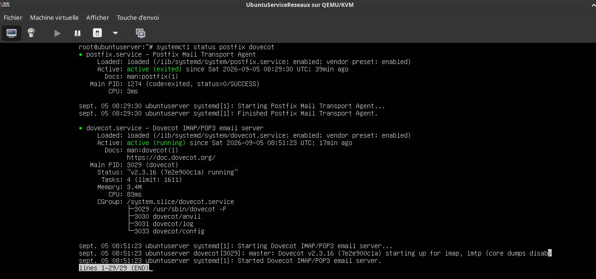
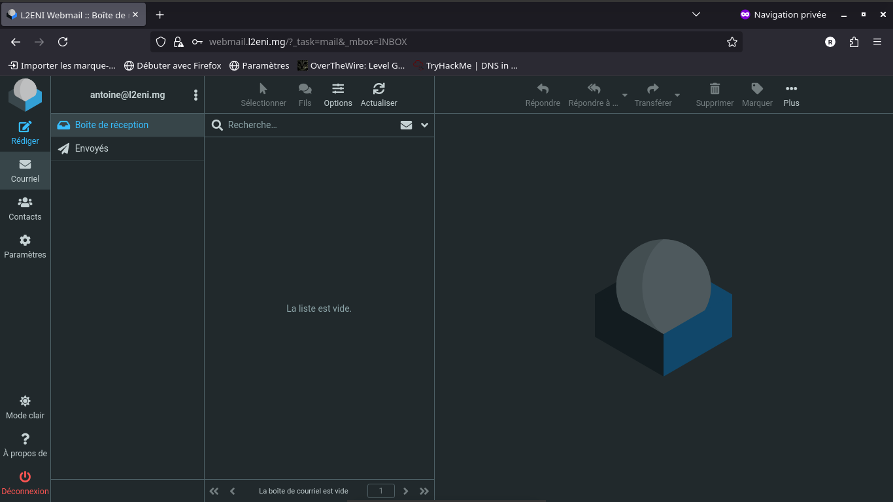
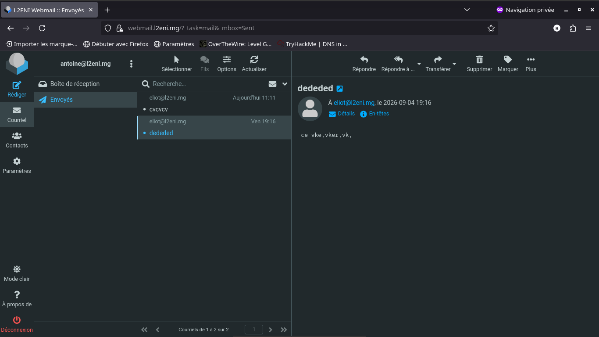
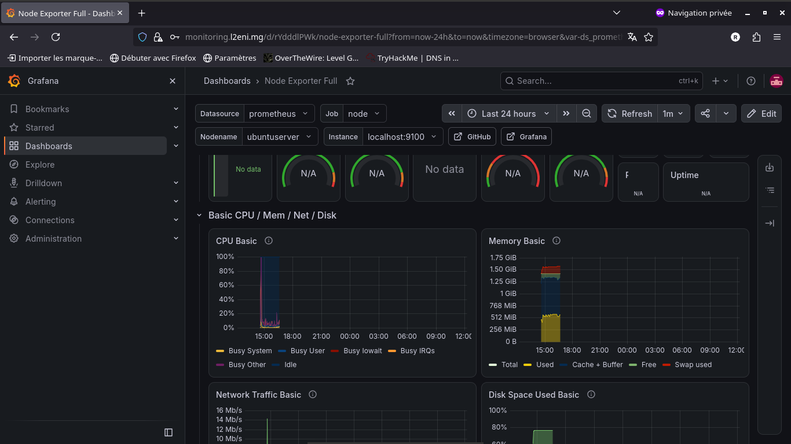
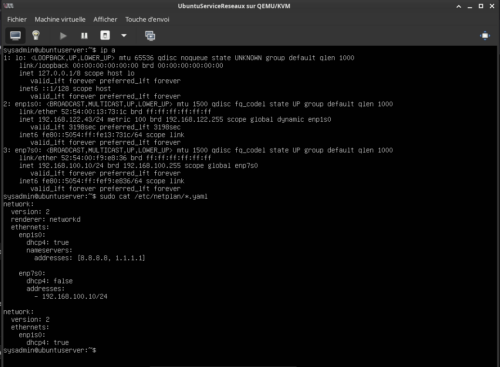

# 🌐 Enterprise Network Services Architecture — L2ENI Domain Infrastructure
> **Hands-on Systems & Network Engineering Lab — BIND9 DNS, OpenLDAP Directory Services, Apache HTTPS, Custom PHP App, Postfix/Dovecot Mail, Roundcube Webmail & Prometheus/Grafana Monitoring**
## 📌 Project Overview
This project demonstrates the end-to-end design, deployment, security hardening, and empirical validation of a centralized enterprise network infrastructure for the domain **`l2eni.mg`** in a Debian 12 / Ubuntu Server environment.
This project demonstrates the design, deployment, security hardening, and validation of a centralized enterprise-style network infrastructure for the domain **`l2eni.mg`** in a fully virtualized environment using **Debian 12 / Ubuntu Server 22.04 LTS**.
The laboratory environment reproduces a complete small-to-medium enterprise (SME) infrastructure where all core network services are interconnected, centrally authenticated, monitored in real time, and secured.
The laboratory environment was designed to reproduce a small-to-medium enterprise (SME) infrastructure where all core network services are interconnected, centrally authenticated, monitored in real time, and secured.
The architecture includes:
- **BIND9 DNS Server** for primary domain name resolution (`l2eni.mg`) and reverse DNS (`100.168.192.in-addr.arpa`)
- **OpenLDAP Directory Services** (`dc=l2eni,dc=mg`) for centralized user identity and authentication
- **Apache2 Web Server** with virtual hosting (`appli.l2eni.mg`, `webmail.l2eni.mg` & `monitoring.l2eni.mg`) and TLS/HTTPS encryption
- **Modern PHP Web Application** (`appli.l2eni.mg`) providing live service monitoring, LDAP directory search, and architecture visualization
- **BIND9** as the primary authoritative DNS server for `l2eni.mg` and reverse DNS (`100.168.192.in-addr.arpa`)
- **OpenLDAP** (`dc=l2eni,dc=mg`) for centralized user identity and authentication
- **Apache2 Web Server** with virtual hosting (`appli.l2eni.mg`, `webmail.l2eni.mg`, `monitoring.l2eni.mg`) and TLS/HTTPS encryption
- **Custom PHP Web Application** (`appli.l2eni.mg`) providing live service monitoring, LDAP directory search, and architecture visualization
- **Postfix & Dovecot Mail Server** for SMTP/IMAP message delivery with LDAP SASL authentication and Maildir storage
- **Roundcube Webmail** (`webmail.l2eni.mg`) providing a responsive web browser client for enterprise messaging
- **Prometheus & Grafana Monitoring Stack** (`monitoring.l2eni.mg`) with Alertmanager for real-time metrics collection, CPU/RAM/Network telemetry, and automated alerting
- **Roundcube Webmail** (`webmail.l2eni.mg`) providing a responsive browser client for enterprise messaging
- **Prometheus & Grafana Monitoring Stack** (`monitoring.l2eni.mg`) with Alertmanager and Node Exporter for real-time telemetry and alerting
The project follows a complete system engineering workflow:
```text
Requirements & Planning
          ↓
Network & Host Setup (192.168.100.10/24)
          ↓
DNS Infrastructure (BIND9)
          ↓
Identity & Directory Services (OpenLDAP)
          ↓
Web Services & SSL/TLS Encryption (Apache2)
          ↓
Custom Admin Application (PHP)
          ↓
Mail Transport & Storage (Postfix/Dovecot)
          ↓
Webmail Client Integration (Roundcube)
          ↓
Monitoring & Alerting Stack (Prometheus + Grafana)
          ↓
Validation, Testing & Hardening
Design & Planning
  ↓
Deployment
  ↓
Network Setup (192.168.100.10/24)
  ↓
DNS & Identity Provisioning (BIND9 / OpenLDAP)
  ↓
Web & Mail Infrastructure (Apache / Postfix / Dovecot)
  ↓
Monitoring & Alerting Setup (Prometheus / Grafana)
  ↓
Validation & Testing
  ↓
Analysis
  ↓
Hardening
```
> ⚠️ **Disclaimer:** All configurations, authentication tests, and network traffic analyses presented in this repository were conducted exclusively in an authorized and controlled laboratory environment for educational purposes (L2 ENI - École Nationale d'Informatique).
---
# 🎯 Objectives
The main objectives of this project were to:
- Design and deploy a single-server enterprise services architecture for the `l2eni.mg` domain.
- Implement static networking (`192.168.100.10/24`) and hostname resolution (`srv-l2eni.l2eni.mg`).
- Configure BIND9 as a primary authoritative DNS server for forward and reverse lookup zones.
- Configure static networking (`192.168.100.10/24`) and hostname resolution (`srv-l2eni.l2eni.mg`).
- Deploy BIND9 as a primary authoritative DNS server for forward and reverse lookup zones.
- Deploy OpenLDAP to store users, groups, and system accounts in a centralized Directory Information Tree (DIT).
- Configure Apache2 VirtualHosts for subdomains (`appli`, `webmail`, `monitoring`) with SSL/TLS certificate binding.
- Configure Apache2 VirtualHosts for subdomains (`appli`, `webmail`, `monitoring`) with SSL/TLS bindings.
- Develop a custom PHP management interface with live LDAP authentication and system diagnostics.
- Configure Postfix (SMTP) and Dovecot (IMAP/LMTP) with LDAP passdb/userdb integration.
- Deploy Roundcube Webmail to allow web-based email exchange between LDAP users.
- Deploy Prometheus, Node Exporter, Alertmanager, and Grafana for full-stack system metrics and visual dashboard telemetry.
- Perform comprehensive protocol validation (`dig`, `ldapsearch`, `curl`, `telnet`, `mailq`, `prometheus`).
- Identify configuration weaknesses and propose hardening recommendations.
- Identify configuration weaknesses and propose hardening measures.
---
# 🏗️ Network & Server Architecture
# 🏗️ Network Architecture
The infrastructure is centralized on a primary enterprise server instance serving multiple virtual services:
The infrastructure is divided into dedicated virtual subdomains and listening ports:
|
 Service / Subdomain 
|
 Network Address 
|
 Port(s) 
|
 Role & Responsibility 
|
|
---
|
---
|
---
|
---
|
|
**
Server Host
**
 (
`srv-l2eni.l2eni.mg`
) 
|
`192.168.100.10`
|
 N/A 
|
 Primary Linux Host (Debian 12 / Ubuntu 22.04) 
|
|
**
DNS Server
**
 (
`ns1.l2eni.mg`
) 
|
`192.168.100.10`
|
`53 (UDP/TCP)`
|
 BIND9 Authoritative & Recursive Resolver 
|
|
**
Directory Server
**
 (
`ldap.l2eni.mg`
) 
|
`192.168.100.10`
|
`389 (TCP)`
|
 OpenLDAP Directory Information Tree 
|
|
**
Web Admin App
**
 (
`appli.l2eni.mg`
) 
|
`192.168.100.10`
|
`80 / 443 (TCP)`
|
 Apache2 VirtualHost + PHP Dashboard 
|
|
**
Webmail Client
**
 (
`webmail.l2eni.mg`
) 
|
`192.168.100.10`
|
`80 / 443 (TCP)`
|
 Roundcube Web Interface 
|
|
**
Monitoring Dashboard
**
 (
`monitoring.l2eni.mg`
)
|
`192.168.100.10`
|
`3000 (TCP)`
|
 Grafana Metrics & Alert Dashboard 
|
|
**
Prometheus Server
**
|
`192.168.100.10`
|
`9090 (TCP)`
|
 Time-Series Metrics Engine 
|
|
**
Alertmanager
**
|
`192.168.100.10`
|
`9093 (TCP)`
|
 Infrastructure Alert Dispatcher 
|
|
**
Node Exporter
**
|
`192.168.100.10`
|
`9100 (TCP)`
|
 OS & Hardware Metrics Exporter 
|
|
**
Mail Transport
**
 (
`mail.l2eni.mg`
) 
|
`192.168.100.10`
|
`25 / 587 (TCP)`
|
 Postfix SMTP & Submission 
|
|
**
Mail Storage / IMAP
**
|
`192.168.100.10`
|
`143 / 993 (TCP)`
|
 Dovecot IMAP / LMTP Engine 
|
|
 Server Host (
`srv-l2eni.l2eni.mg`
) 
|
`192.168.100.10`
|
 N/A 
|
 Primary Linux Host (Debian 12 / Ubuntu 22.04) 
|
|
 DNS Server (
`ns1.l2eni.mg`
) 
|
`192.168.100.10`
|
`53 (UDP/TCP)`
|
 BIND9 Authoritative & Recursive Resolver 
|
|
 Directory Server (
`ldap.l2eni.mg`
) 
|
`192.168.100.10`
|
`389 (TCP)`
|
 OpenLDAP Directory Information Tree 
|
|
 Web Admin App (
`appli.l2eni.mg`
) 
|
`192.168.100.10`
|
`80 / 443 (TCP)`
|
 Apache2 VirtualHost + Custom PHP App 
|
|
 Webmail Client (
`webmail.l2eni.mg`
) 
|
`192.168.100.10`
|
`80 / 443 (TCP)`
|
 Roundcube Web Interface 
|
|
 Monitoring Dashboard (
`monitoring.l2eni.mg`
) 
|
`192.168.100.10`
|
`3000 (TCP)`
|
 Grafana Metrics & Alert Dashboard 
|
|
 Prometheus Server 
|
`192.168.100.10`
|
`9090 (TCP)`
|
 Time-Series Metrics Engine 
|
|
 Alertmanager 
|
`192.168.100.10`
|
`9093 (TCP)`
|
 Infrastructure Alert Dispatcher 
|
|
 Node Exporter 
|
`192.168.100.10`
|
`9100 (TCP)`
|
 OS & Hardware Metrics Exporter 
|
|
 Mail Transport (
`mail.l2eni.mg`
) 
|
`192.168.100.10`
|
`25 / 587 (TCP)`
|
 Postfix SMTP & Submission 
|
|
 Mail Storage / IMAP 
|
`192.168.100.10`
|
`143 / 993 (TCP)`
|
 Dovecot IMAP / LMTP Engine 
|
### Logical Architecture
---
# 🔐 Security Policy & Access Matrix
# 🔐 Security Policy
The infrastructure follows a **centralized authentication, monitoring & least-privilege** model:
The network follows a **defense-in-depth** approach based on:
- All user credentials are stored exclusively inside OpenLDAP (`ou=users,dc=l2eni,dc=mg`).
- Unencrypted HTTP traffic on Port 80 is permanently redirected to HTTPS (Port 443).
- Plaintext authentication is prohibited across external interfaces; TLS/SSL is enforced for Web (HTTPS) and Mail (STARTTLS/SMTPS/IMAPS).
- Grafana dashboard access (`monitoring.l2eni.mg`) is secured via administrator credentials and role-based access control.
- Centralized identity & access control
- Least privilege
- Enforced HTTPS / TLS encryption
- Controlled service exposure
- Real-time telemetry & alerting
- System hardening
### Traffic & Service Policy Matrix
---
# 🌍 DNS Service Architecture — BIND9
# 🌐 BIND9 DNS Server
**BIND9** acts as the primary authoritative DNS server for `l2eni.mg`.
### Configured Zones
It is responsible for:
- **Forward Lookup Zone**: `/etc/bind/zones/db.l2eni.mg` (`l2eni.mg` → `192.168.100.10`)
- **Reverse Lookup Zone**: `/etc/bind/zones/db.192.168.100` (`10.100.168.192.in-addr.arpa` → `srv-l2eni.l2eni.mg`)
- Forward domain lookup (`l2eni.mg` → `192.168.100.10`)
- Reverse DNS lookup (`10.100.168.192.in-addr.arpa` → `srv-l2eni.l2eni.mg`)
- MX record routing (`mail.l2eni.mg`)
- Subdomain resolution (`appli`, `webmail`, `monitoring`)
### Key Records Defined
---
## 🔍 BIND9 DNS Validation Test
## 🔍 BIND9 DNS Resolution Test
The following evidence proves valid forward and MX record resolution using `dig`.
The following screenshot provides evidence of the DNS resolution test performed in the laboratory using `dig`.


---
# 👥 Centralized Directory Services — OpenLDAP
# 👥 OpenLDAP Directory Services
**OpenLDAP** (`slapd`) maintains the enterprise Directory Information Tree (DIT).
## 🔑 OpenLDAP Search & Authentication Test
The screenshots below validate directory schema search and single-user authentication using `ldapwhoami`.
The following screenshots provide evidence of directory schema search and single-user authentication using `ldapsearch` and `ldapwhoami`.

---
## 👤 OpenLDAP User Authentication Test

---
# 🌐 Web Application & VirtualHosts — Apache2 + HTTPS
# 🌐 Web Server & SSL/TLS Encryption
**Apache2** hosts all subdomains using VirtualHosts and SSL/TLS certificate bindings (`/etc/ssl/l2eni/l2eni.crt`).
### VirtualHost Specifications
### Implemented Web Services
- **Application Root**: `/var/www/appli/` (`appli.l2eni.mg`)
- **Webmail Root**: `/var/www/roundcube/` (`webmail.l2eni.mg`)
- **Monitoring Proxy**: ProxyPass `/` `http://127.0.0.1:3000/` (`monitoring.l2eni.mg`)
- **HTTP/HTTPS Handling**: Automatic 301 redirect from Port 80 to Port 443.
- `appli.l2eni.mg` → Custom PHP Web Application (`/var/www/appli/`)
- `webmail.l2eni.mg` → Roundcube Webmail (`/var/www/roundcube/`)
- `monitoring.l2eni.mg` → Grafana Reverse Proxy (`http://127.0.0.1:3000/`)
---
## 🔐 SSL/TLS & Web Application Evidence
## 🔒 SSL Certificate Details
The screenshots below demonstrate HTTPS SSL binding, the modern LDAP login page, the admin dashboard, and the user directory page.
The screenshot below validates the HTTPS SSL binding and certificate details.


---

## 🔐 Custom App Login Page
The screenshot below displays the modern LDAP login page for `appli.l2eni.mg`.

---
## 📊 Custom App Dashboard
The screenshot below displays the admin dashboard after successful LDAP authentication.

---
## 👥 LDAP User Management Page
The screenshot below displays the real-time LDAP directory user search page.


---
## 🗺️ Network Architecture Documentation Page
The screenshot below displays the visual network architecture documentation page.

---
# 📮 Enterprise Mail Infrastructure — Postfix + Dovecot + Roundcube
# 📮 Enterprise Mail Infrastructure
The mail system provides end-to-end messaging:
- **Postfix (MTA)**: Handles SMTP incoming mail (Port 25) and authenticated submission (Port 587).
- **Dovecot (MDA/IMAP)**: Delivers mail via LMTP into `/var/mail/vhosts/l2eni.mg/%n` and serves IMAP/IMAPS.
- **Roundcube (Webmail)**: Offers a complete web GUI with LDAP addressbook integration.
- **Roundcube (Webmail)**: Offers a web GUI with LDAP addressbook integration.
### Mail Delivery Workflow
---
```text
Sender (Alice) → Roundcube → Postfix (SMTP:587 + SASL LDAP)
                                    ↓
                            Dovecot LMTP Socket
                                    ↓
                       Maildir (/var/mail/vhosts/l2eni.mg/bob/)
                                    ↓
Receiver (Bob) ← Roundcube ← Dovecot (IMAP:993 + LDAP passdb)
```
## ⚡ Mail System Service Ports
The screenshot below validates active system listening ports (25, 587, 143, 993, 389, 443, 53).

---
## ✉️ Mail Service Status & Roundcube Validation
## 📮 Roundcube Webmail Login
The screenshots below validate active system listening ports and an end-to-end email exchange between users `alice` and `bob`.
The screenshot below displays the webmail login page for `webmail.l2eni.mg`.



---
## ✉️ Webmail Email Exchange Test
The screenshot below displays an end-to-end email exchange test between `alice` and `bob`.

---
# 📊 Infrastructure Monitoring — Prometheus, Grafana & Alertmanager
# 📊 Prometheus & Grafana Monitoring
A dedicated real-time monitoring and alerting stack was deployed to monitor server metrics and service availability:
A dedicated real-time monitoring and alerting stack was deployed to observe server health and service metrics:
- **Node Exporter (`:9100`)**: Collects hardware/OS metrics (CPU load, memory consumption, disk I/O, network bandwidth).
- **Prometheus (`:9090`)**: Time-series database that scrapes Node Exporter and service targets every 15 seconds.
- **Alertmanager (`:9093`)**: Evaluates firing alerts (e.g. Service Down, Disk Full, High CPU) and dispatches notifications.
- **Grafana (`:3000` / `monitoring.l2eni.mg`)**: Rich web dashboard presenting visual graphs, gauges, and alert status panels.
- **Prometheus (`:9090`)**: Time-series database scraping metrics targets every 15 seconds.
- **Alertmanager (`:9093`)**: Evaluates firing alerts and routes threshold notifications.
- **Grafana (`:3000` / `monitoring.l2eni.mg`)**: Web dashboard presenting visual telemetry graphs and alert status panels.
### Monitoring & Alerting Flow
```text
Host System / Services
          │
    Node Exporter (9100)
          │ Scrape (15s)
          ▼
    Prometheus Server (9090) ───► Alertmanager (9093) ──► Email/Webhook Alert
          │ PromQL Queries
          ▼
    Grafana Dashboard (3000 / monitoring.l2eni.mg)
```
---
## 📈 Monitoring Stack Evidence
## 📈 Grafana Monitoring & Telemetry Dashboard
The screenshot below demonstrates the Grafana authentication and telemetry monitoring interface.
The screenshot below displays the Grafana authentication and telemetry monitoring interface.


---
# 📊 Service Validation & Test Results
# 📊 Security & Service Assessment Results
|
 Service Component 
|
 Test Executed 
|
 Expected Result 
|
 Status 
|
 Assessment 
|
|
---
|
---
|
---
|
---
|
---
|
|
**
Network IP
**
|
`ip a / netplan`
|
 IP 
`192.168.100.10/24`
 assigned 
|
 ✅ PASS 
|
 Static IP routing established 
|
|
**
DNS Resolution
**
|
`dig @127.0.0.1 appli.l2eni.mg`
|
 Returns 
`192.168.100.10`
|
 ✅ PASS 
|
 Authoritative forward DNS functional 
|
|
**
DNS Reverse PTR
**
|
`dig -x 192.168.100.10`
|
 Returns 
`srv-l2eni.l2eni.mg`
|
 ✅ PASS 
|
 Reverse DNS lookup functional 
|
|
**
LDAP Bind
**
|
`ldapwhoami -D "uid=alice..."`
|
`dn:uid=alice...`
 returned 
|
 ✅ PASS 
|
 Centralized authentication verified 
|
|
**
HTTP Redirect
**
|
`curl -I http://appli.l2eni.mg`
|
`301 Moved Permanently`
|
 ✅ PASS 
|
 Port 80 redirected to 443 
|
|
**
HTTPS Security
**
|
`curl -k -I https://appli.l2eni.mg`
|
`HTTP/1.1 200 OK`
|
 ✅ PASS 
|
 SSL/TLS VirtualHost active 
|
|
**
PHP App Auth
**
|
 Web form submission 
|
 Redirect to 
`dashboard.php`
|
 ✅ PASS 
|
 Session created from LDAP 
|
|
**
SMTP Submission
**
|
 Port 587 STARTTLS 
|
 Authentication required 
|
 ✅ PASS 
|
 SASL prevents open relay 
|
|
**
IMAP Delivery
**
|
`telnet localhost 143`
|
 Login OK & mailbox list 
|
 ✅ PASS 
|
 Dovecot Maildir delivery verified 
|
|
**
Webmail Flow
**
|
 Alice → Bob email 
|
 Message visible in Inbox 
|
 ✅ PASS 
|
 Full messaging workflow validated 
|
|
**
Prometheus Metrics
**
|
`curl http://localhost:9090`
|
 Prometheus UI active 
|
 ✅ PASS 
|
 Time-series scraping functional 
|
|
**
Grafana Dashboard
**
|
`curl http://localhost:3000`
|
 Grafana Login 200 OK 
|
 ✅ PASS 
|
 Visualization dashboard active 
|
|
 Security & Service Control 
|
 Result 
|
 Assessment 
|
|
---
|
---
|
---
|
|
 Network IP Assignment 
|
 ✅ PASS 
|
 Static IP 
`192.168.100.10/24`
 configured 
|
|
 Forward DNS Resolution 
|
 ✅ PASS 
|
 Authoritative forward lookup functional 
|
|
 Reverse DNS PTR 
|
 ✅ PASS 
|
 Reverse PTR resolution functional 
|
|
 OpenLDAP Bind Auth 
|
 ✅ PASS 
|
 Centralized authentication verified 
|
|
 HTTP → HTTPS Redirect 
|
 ✅ PASS 
|
 Port 80 redirected to 443 
|
|
 SSL/TLS Encryption 
|
 ✅ PASS 
|
 SSL VirtualHost active 
|
|
 Custom PHP App Auth 
|
 ✅ PASS 
|
 Session created from LDAP 
|
|
 Postfix SMTP Submission 
|
 ✅ PASS 
|
 SASL authentication enforced 
|
|
 Dovecot IMAP Delivery 
|
 ✅ PASS 
|
 Maildir local delivery verified 
|
|
 Webmail Email Exchange 
|
 ✅ PASS 
|
 Full messaging workflow validated 
|
|
 Prometheus Metrics Scraping 
|
 ✅ PASS 
|
 Time-series metrics collection functional 
|
|
 Grafana Dashboard Telemetry 
|
 ✅ PASS 
|
 Visual monitoring dashboard active 
|
|
 Self-Signed SSL Certificate 
|
 ⚠️ NEEDS IMPROVEMENT 
|
 Production requires CA-signed certificate 
|
|
 Unencrypted LDAP (Port 389) 
|
 ⚠️ WEAK 
|
 Enforce STARTTLS or LDAPS (Port 636) 
|
---
# ⚠️ Identified Weaknesses
The security assessment identified several areas requiring improvement before production deployment:
The assessment identified several areas requiring improvement before production deployment.
## 1. Self-Signed SSL Certificate
### Recommendation
- Enable **LDAPS (Port 636)** or enforce **STARTTLS** on port 389 to protect directory credentials in transit across external subnets.
Enable **LDAPS (Port 636)** or enforce **STARTTLS** on port 389 to protect directory credentials in transit.
---
## 3. Single Point of Failure (SPOF)
All services (DNS, LDAP, Web, Mail, Monitoring) reside on a single virtual host instance.
### Recommendation
- Separate roles into dedicated virtual machines or containers (e.g., DNS VM, LDAP VM, Web DMZ VM, Monitoring VM).
Separate roles into dedicated virtual machines or containers (e.g., DNS VM, LDAP VM, Web DMZ VM, Monitoring VM).
---
# 🧪 Testing Methodology
The laboratory follows a rigorous system integration life cycle:
The laboratory follows a simplified system integration life cycle:
```text
1. Network & Static IP Setup (192.168.100.10)
- HTTP/HTTPS Virtual Host Routing & Reverse Proxying
- SMTP / IMAP / LMTP Protocol Flow & Ports
## System & Directory Administration
## System Administration
- OpenLDAP DIT Design, LDIF Scripting & `slapd` Reconfiguration
- Linux User & Group Permissions (`vmail`, `www-data`, `chown`/`chmod`)
- Apache2 Module Management (`mod_ssl`, `mod_rewrite`, `mod_proxy`)
- Postfix `main.cf` / `master.cf` & Dovecot `auth-ldap` Integration
## Monitoring & Observability
## Defensive Security & Observability
- System Hardening & Access Control
- Prometheus Time-Series Metrics Scraping & PromQL Querying
- Node Exporter Telemetry Collection (CPU, Memory, Disk, Network)
- Alertmanager Rule Thresholding & Routing
# 🛠️ Technology Stack
|
 Category 
|
 Technology / Tool 
|
|
 Category 
|
 Technology 
|
|
---
|
---
|
|
**
Operating System
**
|
 Debian 12 / Ubuntu Server 22.04 LTS 
|
|
**
DNS Server
**
|
 BIND9 (
`named`
) 
|
|
**
Directory Server
**
|
 OpenLDAP (
`slapd`
) 
|
|
**
Web Server
**
|
 Apache2 
|
|
**
Programming Language
**
|
 PHP 8.2 (with 
`php-ldap`
, 
`php-curl`
, 
`php-mbstring`
) 
|
|
**
Mail Transfer Agent
**
|
 Postfix 
|
|
**
Mail Delivery Agent
**
|
 Dovecot 
|
|
**
Webmail Client
**
|
 Roundcube 1.6.6 
|
|
**
Metrics Engine
**
|
 Prometheus 2.x 
|
|
**
Metrics Exporter
**
|
 Node Exporter 
|
|
**
Alerting System
**
|
 Alertmanager 
|
|
**
Visualization UI
**
|
 Grafana 10.x 
|
|
**
Database
**
|
 MariaDB (for Roundcube & Grafana) 
|
|
**
Security & SSL
**
|
 OpenSSL (X.509 Certificates) 
|
|
 Operating System 
|
 Debian 12 / Ubuntu Server 22.04 LTS 
|
|
 DNS Server 
|
 BIND9 (
`named`
) 
|
|
 Directory Server 
|
 OpenLDAP (
`slapd`
) 
|
|
 Web Server 
|
 Apache2 
|
|
 Programming Language 
|
 PHP 8.2 (with 
`php-ldap`
, 
`php-curl`
, 
`php-mbstring`
) 
|
|
 Mail Transfer Agent 
|
 Postfix 
|
|
 Mail Delivery Agent 
|
 Dovecot 
|
|
 Webmail Client 
|
 Roundcube 1.6.6 
|
|
 Metrics Engine 
|
 Prometheus 2.x 
|
|
 Metrics Exporter 
|
 Node Exporter 
|
|
 Alerting System 
|
 Alertmanager 
|
|
 Visualization UI 
|
 Grafana 10.x 
|
|
 Database 
|
 MariaDB (for Roundcube & Grafana) 
|
|
 Security & SSL 
|
 OpenSSL (X.509 Certificates) 
|
---
# 📸 Evidence & Validation Gallery
# 📸 Evidence & Validation
The following screenshots document the practical implementation and validation of the laboratory:
The following screenshots document the practical implementation and validation of the laboratory.
### Network & Infrastructure Setup
## Network & Infrastructure Setup
#### 1. Static IP & Network Interface (`01_netplan_ip.png`)
### Static IP & Network Interface

#### 2. BIND9 DNS Resolution Test (`02_bind9_dig_test.png`)
### BIND9 DNS Resolution Test

---
### OpenLDAP Directory Services
## OpenLDAP Directory Services
#### 3. LDAP Directory Search (`03_ldap_search.png`)
### LDAP Directory Search

#### 4. User Authentication Test (`04_ldap_user_alice.png`)
### User Authentication Test

---
### Web Services & Custom Application
## Web Services & Custom Application
#### 5. SSL/TLS Certificate Verification (`05_ssl_certificate.png`)
### SSL/TLS Certificate Verification

#### 6. Custom App Login Page (`06_app_login_page.png`)
### Custom App Login Page

#### 7. Admin Dashboard (`07_app_dashboard.png`)
### Admin Dashboard

#### 8. LDAP User Management (`08_app_users_ldap.png`)
### LDAP User Management

#### 9. Network Architecture Overview (`09_app_architecture.png`)
### Architecture Documentation Page

---
### Messaging & Webmail Services
## Messaging & Webmail Services
#### 10. Mail & Network Service Ports (`10_postfix_dovecot_status.png`)
### Mail Service Status & Listening Ports

#### 11. Roundcube Webmail Login (`11_roundcube_login.png`)
### Roundcube Webmail Login

#### 12. Full Mail Exchange Test (`12_roundcube_mail_exchange.png`)
### Full Mail Exchange Test

---
### Monitoring & Infrastructure Telemetry
## Infrastructure Monitoring
#### 13. Grafana Monitoring Dashboard (`13_monitoring.png`)
### Grafana Monitoring Dashboard

---
# 📈 Infrastructure Summary & Defense-in-Depth
# 📈 Infrastructure & Security Summary
The architecture demonstrates how multiple network services interact in a unified enterprise environment:
---
# 🛡️ Defense in Depth
The infrastructure architecture follows a layered security model:
```text
                 ┌──────────────────┐
                 │ Static IP Setup  │
                 └────────┬─────────┘
                          ↓
                 ┌──────────────────┐
                 │ BIND9 DNS        │
                 └────────┬─────────┘
                          ↓
                 ┌──────────────────┐
                 │ OpenLDAP Auth    │
                 └────────┬─────────┘
                          ↓
                 ┌──────────────────┐
                 │ Apache HTTPS     │
                 └────────┬─────────┘
                          ↓
                 ┌──────────────────┐
                 │ Postfix / Dovecot│
                 └────────┬─────────┘
                          ↓
                 ┌──────────────────┐
                 │ Prometheus/Grafana│
                 └────────┬─────────┘
                          ↓
                 ┌──────────────────┐
                 │ Hardening        │
                 └──────────────────┘
```
This layered approach ensures that identity, encryption, messaging, and telemetry work together to protect and monitor the infrastructure.
---
# 🚀 Future Improvements
- Implement **OpenLDAP Replication (Syncrepl)** for high availability.
- Configure **Let's Encrypt / Certbot** for automated SSL certificate renewal.
- Integrate **Wazuh SIEM / Fail2ban** for brute-force protection on SSH, Web, and Mail ports.
- Separate services into isolated **Docker containers** or **KVM virtual machines**.
- Implement **DKIM, DMARC, and DNSSEC** for strict email and domain validation.
- Configure automated Slack/Discord/Email notifications in **Alertmanager** for server alerts.
Possible future developments include:
- Deploying OpenLDAP Replication (Syncrepl) for high availability.
- Configuring Let's Encrypt / Certbot for automated SSL certificate renewal.
- Integrating Wazuh SIEM / Fail2ban for brute-force protection on SSH, Web, and Mail ports.
- Separating services into isolated Docker containers or KVM virtual machines.
- Implementing DKIM, DMARC, and DNSSEC for strict email and domain validation.
- Configuring automated Slack/Discord/Email notifications in Alertmanager.
---
# ⚠️ Laboratory Limitations
This project is an educational engineering laboratory and should not be considered a production-ready enterprise architecture without additional controls.
A production environment would require:
- High-availability redundant DNS & LDAP servers
- VLAN-based network segmentation
- Centralized SIEM and EDR agent monitoring
- Multi-factor authentication (MFA)
- Enterprise Public Key Infrastructure (PKI)
- Automated off-site backups and disaster recovery plans
---
# 🏁 Conclusion
This project demonstrates the practical design, implementation, and validation of an enterprise network infrastructure for **`l2eni.mg`**:
This project demonstrates the practical design, implementation, and validation of a centralized network infrastructure using:
**BIND9 + OpenLDAP + Apache2 + Custom PHP App + Postfix + Dovecot + Roundcube + Prometheus + Grafana**
The laboratory validates core system engineering workflows:
The laboratory validates the complete system lifecycle:
```text
DESIGN → PROVISION → INTEGRATE → AUTHENTICATE → MONITOR → SECURE → VALIDATE
DESIGN → DEPLOY → PROVISION → INTEGRATE → MONITOR → TEST → ANALYZE → HARDEN
```
The primary takeaway from this project is that centralized identity management (OpenLDAP) combined with authoritative DNS, SSL/TLS web/mail protocols, and real-time observability (Prometheus/Grafana) provides a robust, scalable, and manageable foundation for modern enterprise network services.
The main lesson demonstrated by this laboratory is that effective system administration requires multiple complementary infrastructure layers working in unison:
```text
Static Networking
      +
Authoritative DNS
      +
Directory Identity (OpenLDAP)
      +
HTTPS Web Services
      +
Authenticated Messaging
      +
Real-time Monitoring (Prometheus/Grafana)
      =
Enterprise Infrastructure Readiness
```
---
## 📚 Project Metadata
## 📚 Project Information
|
 Item 
|
 Details 
|
|
---
|
---
|
|
**
Project Title
**
|
 L2ENI Enterprise Network Services & Monitoring Lab 
|
|
**
Institution
**
|
 École Nationale d'Informatique (ENI) 
|
|
**
Academic Level
**
|
 L2 Network & Systems Engineering 
|
|
**
Domain Name
**
|
`l2eni.mg`
|
|
**
Primary IP
**
|
`192.168.100.10/24`
|
|
**
Target OS
**
|
 Debian 12 / Ubuntu Server 22.04 LTS 
|
|
**
Repository License
**
|
 MIT 
|
|
 Project Type 
|
 Enterprise Network Services & Monitoring Lab 
|
|
 Institution 
|
 École Nationale d'Informatique (ENI) 
|
|
 Academic Level 
|
 L2 Network & Systems Engineering 
|
|
 Domain Name 
|
`l2eni.mg`
|
|
 Primary IP 
|
`192.168.100.10/24`
|
|
 Target OS 
|
 Debian 12 / Ubuntu Server 22.04 LTS 
|
|
 Repository License 
|
 MIT 
|
> **All network and service tests were performed in an isolated, authorized virtual laboratory environment for academic and practical engineering validation.**
> **All network and service tests were performed in an isolated and authorized virtual laboratory environment for academic and practical engineering validation.**
